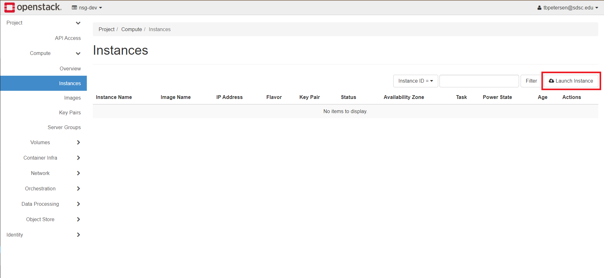
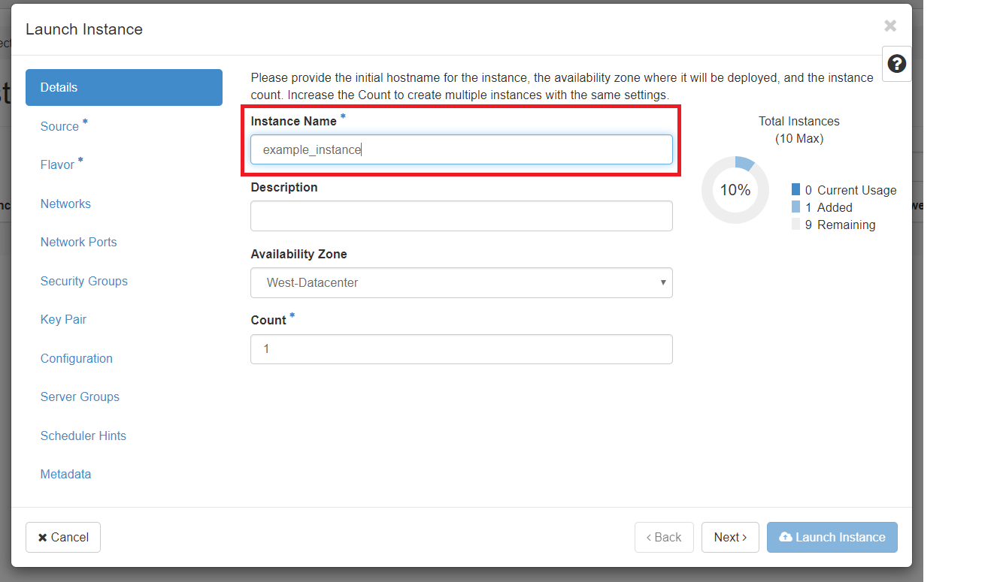
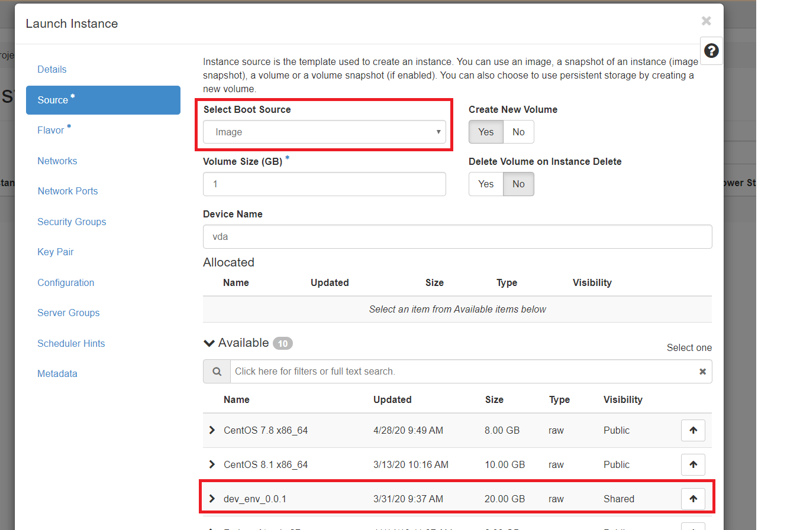
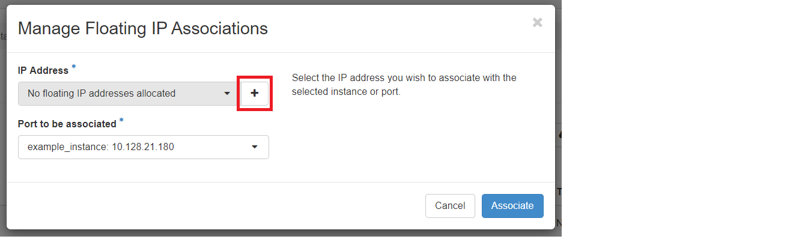
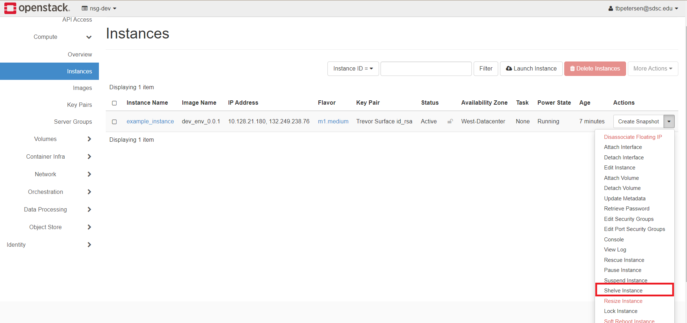

## Introduction
This is the user doc for the cloud environment that the Neuroscience Gateway
(NSG) provides for neuroscience tool developers. The SDSC cloud based developer
environment allows neuroscience tool developers to create a suitable instance
on the SDSC cloud and use an image that includes basic software stack and tools
that neuroscience tool developers may use for their tool development work. It
provides:

* Python 2.7
* Python 3
* TightVNC
* Google Chrome (for use with VNC)
* Jupyter
* Open MPI 3.1.4
* Neuron 7.7
* Singularity 3.1.0

It allows developers to put software in a Singularity container, connect to a
VNC server, run Jupyter Notebook etc. Based on needs of the neuroscientist tool
developers, other software and features will be provided in the tool development
environment.

## Getting Started

Development is done on the SDSC Cloud. To access the cloud dashboard,
follow [this link](https://dashboard.cloud.sdsc.edu/). You will log in
with the username and password given to you by NSG.

## Adding an SSH Key
Before launching any instances, you should upload an SSH key so that you can authenticate with them. Navigate to the **Key Pairs** page by going to **Project** ->
**Compute** -> **Key Pairs** in the navigation menu on the left.

You can either create a key pair using the dashboard or upload an
existing public key.

### Create a Key Pair
Click **Create Key Pair** on the right side of the screen. Give it any name
that you would like and select **SSH Key** as the key type. Finally, click
**Create Key Pair**. Your browser will automatically download the private key 
for you.

### Upload a Public Key
Click **Import Public Key** on the right side of the screen. Give it any name
that you would like and select **SSH Key** as the key type. Then either select
the public key file or paste its contents into the text box. Finally,
click **Import Public Key**.

## Adding an SSH Security Group
Before you are able to use your SSH key to authenticate with an instance,
you will need to set up a security group that will allow SSH connections.

Navigate to the **Security Groups** page. You can do this by going to **Project**
-> **Network** -> **Security Groups** in the navigation menu on the left.

Click **Create Security Group** on the right side of the screen. In the popup
window, name the security group "SSH" and then click **Create Security Group**.
Next, click **Add Rule** on the right side of the screen. In the **Rule** 
dropdown, select **SSH**. Click **Add** to add the rule.

## Launching a Development Instance
Development instances on the SDSC Cloud come prepackaged with software for
development.

Navigate to the **Instances** page.
You can do this by going to **Project** -> **Compute** -> **Instances** in the 
navigation menu on the left.

Click **Launch Instance** on the right side of the screen.

In the popup window, give your new instance any name you would like.

Click on **Source** on the left. In the dropdown for **Select Boot Source**,
select **Image**. Under the **Available** section, select **dev_env_0.0.1**
by clicking on the up arrow at the end of the row.

Click on **Flavor** on the left. Select the flavor with the CPU and RAM
configuration that meets your needs by clicking on the up arrow at the end
of the row. For this example, I will use **m1.medium**.

Click on **Security Groups** on the left. Select the **SSH** security group
that you created earlier by clicking on the up arrow at the end of the row.

Click on **Key Pair** on the left. Select the SSH Key that you created earlier
by clicking on the up arrow at the end of the row.

Click **Launch Instance** on the bottom right of the popup to finish.

### Getting a public IP Address
Your newly created instance will not be able to be reached until you
give it a public IP address by **Associating a Floating IP** with it.
From the instances page, find the instance that you would like to add an
IP to. Click the dropdown arrow at the end of the row and click 
**Associate Floating IP**.

In the **IP Address** field, click the + at the end.

In the popup window, click **Allocate IP**. Then click **Associate** in the
bottom right of the popup window.

Your instance should now be accessible at the associated IP address. Note that 
this is the IP address that starts with **132.\*** not **10.\*** .

## Connecting to an Instance
You should be able to connect to your instances using the SSH key that you
selected when created the instance.

For help connecting from Mac or Linux, look [here](https://sdsc-ucsd.atlassian.net/wiki/spaces/SC/pages/110034993/SSH+to+Instance+using+Mac+and+Linux).
For help connecting from Windows, look [here](https://sdsc-ucsd.atlassian.net/wiki/spaces/SC/pages/110034995/SSH+to+Instance+using+Windows).

## Shelving an Instance
Instances should only be kept running when they are being used. When instances
are not in use, they should be _shelved_. Shelved instances are essentially
paused until they are needed again. Data stays on shelved instances and is
not lost.

From the instances page, find the instance that you would like to shelve.
Click the dropdown arrow at the end of the row and click 
**Shelve Instance**.

## Unshelving an Instance
From the instances page, find the instance that you would like to unshelve.
Click the dropdown arrow at the end of the row and click 
**Unshelve Instance**.

## More Information and Guides
For more information and guides on how to use the SDSC cloud, see the 
[SDSC Cloud Wiki](https://sdsc-ucsd.atlassian.net/wiki/spaces/SC/overview).